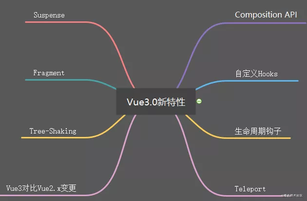
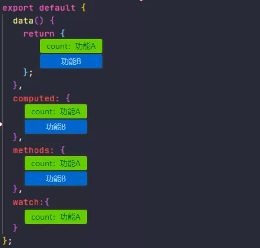
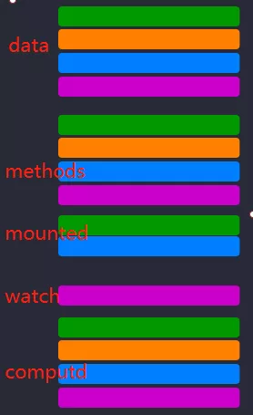
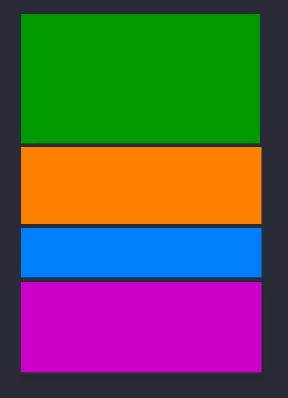
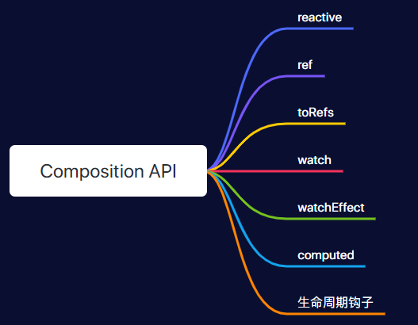
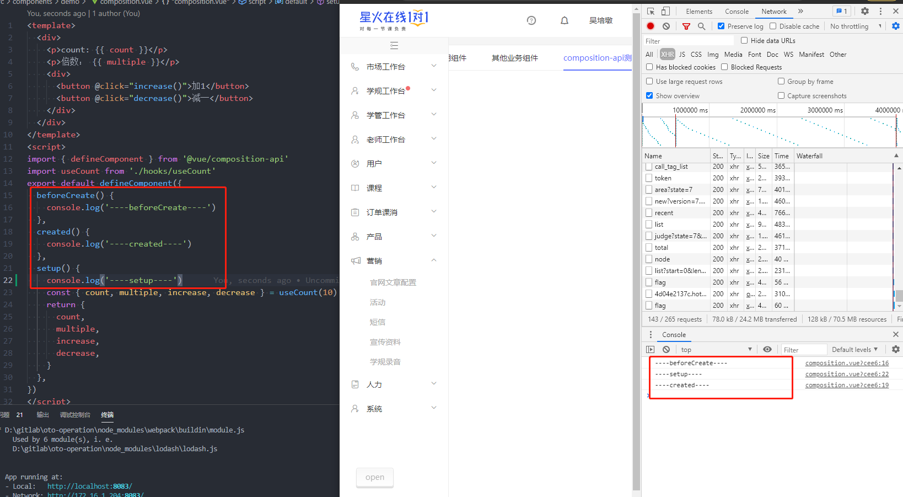

# Vue3.0新特性的使用以及一些用法上的变更。



在日常的开发过程中，往往每个迭代都会在某个模块上加入一些新的功能, 只要一加新功能，就需要去data、methods、computed中进行操作, 当我们增加一个新功能时，就会出现下图的情况：

当我们业务复杂了就会大量出现上面的情况， 随着复杂度上升，就会出现这样一张图， 每个颜色的方块表示一个功能：

有时候一个功能还可能依赖其他功能，全搅合在一起。当这个组件的代码超过几百行时，这时增加或者修改某个需求， 就要在data、methods、computed以及mounted中反复的横跳。
如果可以按照逻辑进行分割，将上面这张图变成下边这张图， 这样的代码可读性和可维护性都更高：

vue2.x版本给出的解决方案就是Mixin, 但是使用Mixin也会遇到让人苦恼的问题：
1. 命名冲突问题
2. 不清楚暴露出来的变量的作用
3. 逻辑重用到其他 component 经常遇到问题

所以，Vue3.x就推出了Composition API主要就是为了解决上面的问题，将零散分布的逻辑组合在一起来维护，并且还可以将单独的功能逻辑拆分成单独的文件。

接下来就来看下Composition API


1. setup
setup 是Vue3.x新增的一个选项， 他是组件内使用 Composition API的入口。
setup执行时机是在 beforeCreate和created之间(有人说 setup 执行时机是在beforeCreate之前执行, 我自己试了下是在beforeCreate和created之间)

`由于setup执行时尚未创建组件实例，因此选项this内没有任何内容setup。这意味着，除了props，您将无法访问组件中声明的任何属性-本地状态，计算属性或方法，因此在 setup 选项中没有 this。`
使用setup时，它接受两个参数：
 - props: 组件传入的属性
 - context

setup中接受的props是响应式的， 当传入新的props 时，会及时被更新。由于是响应式的，所以不可以使用ES6解构，解构会消除它的响应式。setup中不能访问Vue2中最常用的this对象，所以context中就提供了this中最常用的三个属性：attrs、slot 和emit，分别对应Vue2.x中的 $attr属性、slot插槽 和$emit 发射事件。并且这几个属性都是自动同步最新的值，所以我们每次使用拿到的都是最新值。

2. reactive、ref与toRefs
在vue2.x中， 定义数据都是在data中， 但是Vue3.x 可以使用reactive和ref来进行数据定义。
reactive 和 ref 都是用来定义响应式数据的 reactive更推荐去定义复杂的数据类型 ref 更推荐定义基本类型。ref 和 reactive 本质我们可以简单的理解为ref是对reactive的二次包装, ref定义的数据访问的时候要多一个.value

总结ref和reactive区别:
  - 如果在template里使用的是ref类型的数据, 那么Vue会自动帮我们添加.value
    如果在template里使用的是reactive类型的数据, 那么Vue不会自动帮我们添加.value

  - Vue是如何决定是否需要自动添加.value的
    Vue在解析数据之前, 会自动判断这个数据是否是ref类型的,
    如果是就自动添加.value, 如果不是就不自动添加.value

  - Vue是如何判断当前的数据是否是ref类型的
    通过当前数据的__v_ref来判断的
    如果有这个私有的属性, 并且取值为true, 那么就代表是一个ref类型的数据
可以通过isRef / isReactive 方法来判断数据到底是ref还是reactive
``` javascript
  setup() {
    let age = reactive({value: 18});
    console.log(isRef(age)); //false
    console.log(isReactive(age));  //true
    return {age}
  }
```
toRefs用于将一个reactive对象转化为属性全部为ref对象的普通对象。具体使用方式如下：
```javascript
<template>
  <div>
    <p>第 {{ year }} 年</p>
    <p>姓名： {{ nickname }}</p>
    <p>年龄： {{ age }}</p>
  </div>
</template>

<script>
import { defineComponent, reactive, ref ,toRefs} from "vue";
export default defineComponent({
  setup() {
    const year = ref(0);
    const user = reactive({ nickname: "kyrie", age: 25, gender: "男" });
    setInterval(() =>{
        year.value ++
        user.age ++
    }, 1000)
    return {
        year,
        // 使用reRefs
        ...toRefs(user)
    }
  },
});
</script>
```
3. watch的用法

watch 函数用来侦听特定的数据源，并在回调函数中执行副作用。默认情况是惰性的，也就是说仅在侦听的源数据变更时才执行回调。

```javascript
watch(source, callback, [options])
```
参数说明：
- source:可以支持string,Object,Function,Array; 用于指定要侦听的响应式变量
- callback: 执行的回调函数
- options：支持deep、immediate 和 flush 选项。

侦听reactive定义的数据
```javascript
const year = ref(0)

setTimeout(() =>{
    year.value ++ 
},1000)

watch(year, (newVal, oldVal) =>{
  console.log("新值:", newVal, "老值:", oldVal);
})
```

侦听多个数据
```javascript
watch([() => state.age, year], ([curAge, preAge], [newVal, oldVal]) => {
    console.log("新值:", curAge, "老值:", preAge);
    console.log("新值:", newVal, "老值:", oldVal);
});
```
4. 自定义 Hooks
useCount.ts
```javascript
import { ref, Ref, computed } from "vue";

type CountResultProps = {
    count: Ref<number>;
    multiple: Ref<number>;
    increase: (delta?: number) => void;
    decrease: (delta?: number) => void;
};

export default function useCount(initValue = 1): CountResultProps {
    const count = ref(initValue);

    const increase = (delta?: number): void => {
        if (typeof delta !== "undefined") {
            count.value += delta;
        } else {
            count.value += 1;
        }
    };
    const multiple = computed(() => count.value *2 )

    const decrease = (delta?: number): void => {
        if (typeof delta !== "undefined") {
            count.value -= delta;
        } else {
            count.value -= 1;
        }
    };

    return {
        count,
        multiple,
        increase,
        decrease,
    };
}
```
接下来看一下在组件中使用useCount这个 hook:
```typescript
<template>
  <p>count: {{ count }}</p>
  <p>倍数： {{ multiple }}</p>
  <div>
    <button @click="increase()">加1</button>
    <button @click="decrease()">减一</button>
  </div>
</template>

<script lang="ts">
import useCount from "../hooks/useCount";
 setup() {
    const { count, multiple, increase, decrease } = useCount(10);
        return {
            count,
            multiple,
            increase,
            decrease,
        };
    },
</script>
```
5. 更好的 Tree-Shaking
Vue3.x 在考虑到 tree-shaking的基础上重构了全局和内部API, 表现结果就是现在的全局API需要通过 ES Module的引用方式进行具名引用， 比如在Vue2.x中，我们要使用 nextTick:
```javascript
// vue2.x
import Vue from "vue"

Vue.nextTick(()=>{
    ...
})
```
在 Vue3.x中改写成这样：
```javascript
import { nextTick } from "vue"

nextTick(() =>{
    ...
})
```
6. v-model 升级
在Vue2 中， 在组件上使用 v-model其实就相当于传递了value属性， 并触发了input事件：
```html
<!-- Vue 2 -->
<search-input v-model="searchValue"><search-input>

<!-- 相当于 -->
<search-input :value="searchValue" @input="searchValue=$event"><search-input>
```

v-model只能绑定在组件的value属性上,如果给自己的组件用一个别的属性，并且我们不想通过触发input来更新值，在.async出来之前，Vue 2 中这样实现：
```javascript
// 子组件：searchInput.vue
export default {
  model:{
      prop: 'search',
      event:'change'
  }
}
```
在实际开发中，有些场景我们可能需要对一个 prop 进行“双向绑定”， 这里以最常见的 modal为例子：modal挺合适属性双向绑定的，外部可以控制组件的visible显示或者隐藏，组件内部关闭可以控制 visible属性隐藏，同时visible 属性同步传输到外部。组件内部， 当我们关闭modal时, 在子组件中以update:PropName模式触发事件：
```javascript
this.$emit('update:visible', false)
```
然后在父组件中可以监听这个事件进行数据更新：
```html
<modal :visible="isVisible" @update:visible="isVisible = $event"></modal>
```
也可以使用v-bind.async来简化实现：
```html
<modal :visible.async="isVisible"></modal>
```
在Vue3 中,在自定义组件上使用v-model,相当于传递一个modelValue 属性， 同时触发一个update:modelValue事件：
```html
<modal v-model="isVisible"></modal>

<!-- 相当于 -->
<modal :modelValue="isVisible" @update:modelValue="isVisible = $event"></modal>
```
如果要绑定属性名， 只需要给v-model传递一个参数就行, 同时可以绑定多个v-model：
```html
<modal v-model:visible="isVisible" v-model:content="content"></modal>

<!-- 相当于 -->
<modal 
    :visible="isVisible"
    :content="content"
    @update:visible="isVisible"
    @update:content="content"
/>
```
所以啊，Vue 3中抛弃了.async写法， 统一使用v-model

7. 生命周期
  
  ```javascript
    import { defineComponent, onBeforeMount, onMounted, onBeforeUpdate,onUpdated, onBeforeUnmount, onUnmounted, onErrorCaptured, onRenderTracked, onRenderTriggered
    } from "vue";

    export default defineComponent({
      // beforeCreate和created是vue2的
      beforeCreate() {
        console.log("------beforeCreate-----");
      },
      created() {
        console.log("------created-----");
      },
      setup() {
        console.log("------setup-----");

        // vue3.x生命周期写在setup中
        onBeforeMount(() => {
          console.log("------onBeforeMount-----");
        });
        onMounted(() => {
          console.log("------onMounted-----");
        });
        // 调试哪些数据发生了变化
        onRenderTriggered((event) =>{
            console.log("------onRenderTriggered-----",event);
        })
    },
});
  ```
vue官方文档： https://v3.vuejs.org/guide/composition-api-introduction.html#why-composition-api

在vue2.0的项目接入Composition Api: https://github.com/vuejs/composition-api/blob/master/README.zh-CN.md